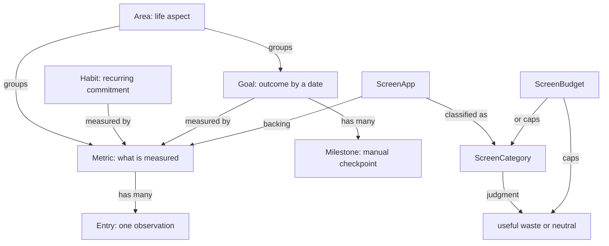
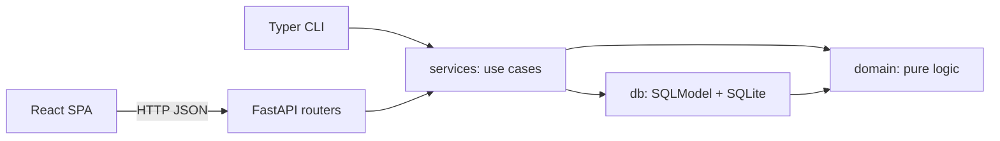

# Atlas architecture

This document is the living source of truth for Atlas, maintained alongside the code. A change in behavior and the matching edit here belong to the same cycle: code and this document disagreeing is a bug, not a stale doc.

## Purpose

Atlas is a single-user, local-first life-tracking backend. It records what actually happened, then layers commitments (habits) and outcomes (goals) on top of that record. Everything a review screen wants to show — streaks, adherence, goal progress, whether a goal is on pace — is computed on read from the recorded facts.

Consequences of that stance:

- Backfilling an entry for last Tuesday automatically corrects every streak, adherence ratio, and goal percentage that depends on it. There is no recalculation step and nothing to migrate.
- There is exactly one capture path. Habits and goals point at metrics; they never store their own observations.
- The HTTP API is the only consumer path. The CLI is an in-process adapter over the same service layer. The React SPA in `web/` is an HTTP client of that API: it has no privileged access and no streaks, adherence, or progress of its own to reimplement.


## Data model

Integer primary keys are internal. Slugs are the human key and are what the CLI and the API accept: unique per entity type, lowercase, `[a-z0-9-]`.




### Area

A life aspect that groups metrics and goals: Health, Career, Finance, Relationships.


| Field         | Type            | Notes                                                       |
| ------------- | --------------- | ----------------------------------------------------------- |
| `id`          | int             | primary key                                                 |
| `slug`        | str             | unique                                                      |
| `name`        | str             | display name                                                |
| `description` | str | None      |                                                             |
| `archived_at` | datetime | None | UTC; archived areas are hidden from views but never deleted |


### Metric

The definition of a measurable thing. A metric says what a value means and how same-period values roll up; it stores no values itself.


| Field         | Type            | Notes                                                                    |
| ------------- | --------------- | ------------------------------------------------------------------------ |
| `id`          | int             | primary key                                                              |
| `area_id`     | int             | FK to `Area`                                                             |
| `slug`        | str             | unique                                                                   |
| `name`        | str             |                                                                          |
| `value_type`  | enum            | `bool | count | quantity | duration | rating | text`                     |
| `unit`        | str | None      | free text, for display only (`reps`, `kg`, `min`)                        |
| `aggregation` | enum            | `sum | last | mean | max | min` — how entries in the same period combine |
| `direction`   | enum            | `higher_is_better | lower_is_better | neutral`                           |
| `archived_at` | datetime | None | UTC                                                                      |


`aggregation` is the field that makes one entry table serve everything: pushups sum across a day, bodyweight takes the last reading, mood averages.

`duration` values are stored in minutes (including fractional minutes). `bool` values are stored in `value_bool` and count as `1.0` / `0.0` wherever arithmetic is needed.

### Entry

One observation of a metric. Entries are the only stored facts in Atlas and are treated as immutable in spirit: they are corrected through amend and delete, never silently rewritten by derived logic.


| Field         | Type            | Notes                                                                       |
| ------------- | --------------- | --------------------------------------------------------------------------- |
| `id`          | int             | primary key                                                                 |
| `metric_id`   | int             | FK to `Metric`                                                              |
| `occurred_on` | date            | **local** date in `ATLAS_TZ`; the answer to "which day does this count for" |
| `occurred_at` | datetime | None | UTC; optional precise time, used to order entries within a day              |
| `value_num`   | float | None    | for `count`, `quantity`, `duration`, `rating`                               |
| `value_bool`  | bool | None     | for `bool`                                                                  |
| `value_text`  | str | None      | for `text`                                                                  |
| `note`        | str | None      | free text                                                                   |
| `source`      | enum            | `cli | api | import`                                                        |
| `created_at`  | datetime        | UTC, set on insert                                                          |


Multiple entries per metric per day are always allowed; the metric's `aggregation` resolves them. There is no uniqueness constraint on `(metric_id, occurred_on)`.

### Habit

A recurring commitment over a metric: a schedule plus a target.


| Field          | Type            | Notes                                                                                   |
| -------------- | --------------- | --------------------------------------------------------------------------------------- |
| `id`           | int             | primary key                                                                             |
| `metric_id`    | int             | FK to `Metric`                                                                          |
| `slug`         | str             | unique                                                                                  |
| `name`         | str             |                                                                                         |
| `period`       | enum            | `day | week | month` — the bucket the target applies to                                 |
| `target_value` | float           |                                                                                         |
| `comparator`   | enum            | `at_least | at_most | exactly`                                                          |
| `weekdays`     | set[int] | None | ISO weekdays (Mon=1 … Sun=7); only valid when `period` is `day`, `None` means every day |
| `active_from`  | date            | inclusive                                                                               |
| `active_to`    | date | None     | inclusive; `None` means open-ended                                                      |


`at_most` is not an afterthought: "no more than one coffee a day" and "at least three runs a week" are the same machinery with a different comparator.

### ScreenCategory

A named bucket for screen apps, such as entertainment or learning. The **judgment** (`useful | waste | neutral`) lives here, not on the app. Reclassifying entertainment from waste to useful moves every member app's minutes into a different judgment total on the next read.

Screen taxonomy is a dedicated slice of Atlas. Creating the first category also creates the well-known area `screen` when it is missing. Each app gets a backing duration metric in that area so sessions stay ordinary entries.


| Field         | Type            | Notes                                      |
| ------------- | --------------- | ------------------------------------------ |
| `id`          | int             | primary key                                |
| `slug`        | str             | unique (`entertainment`)                   |
| `name`        | str             |                                            |
| `judgment`    | enum            | `useful \| waste \| neutral`               |
| `archived_at` | datetime \| None | UTC                                       |


### ScreenApp

What you used: Instagram, YouTube, a code editor. One category. One backing duration metric (`sum`, unit `min`). `metric.direction` mirrors the category's current judgment (`useful` → `higher_is_better`, `waste` → `lower_is_better`, `neutral` → `neutral`). Changing a category's judgment updates member metrics. Grouping on the screen view always uses category → judgment, not a copy on the app.


| Field         | Type            | Notes                                         |
| ------------- | --------------- | --------------------------------------------- |
| `id`          | int             | primary key                                   |
| `slug`        | str             | unique (`instagram`); same slug as the metric |
| `name`        | str             |                                               |
| `category_id` | int             | FK to `ScreenCategory`                        |
| `metric_id`   | int             | unique FK to `Metric`                         |
| `archived_at` | datetime \| None | UTC                                          |


### ScreenBudget

A threshold over a **judgment** or a **category**, not over a single metric. "Keep waste under 90 minutes a day" is `target_kind=judgment`, `target_slug=waste`, `comparator=at_most`. An entertainment cap uses `target_kind=category`. App-level caps stay ordinary habits on the app's metric.

`screen_view` merges entries from every member app and runs the existing streak / adherence functions over that list. Totals are never stored.


| Field          | Type            | Notes                                      |
| -------------- | --------------- | ------------------------------------------ |
| `id`           | int             | primary key                                |
| `slug`         | str             | unique                                     |
| `name`         | str             | e.g. Waste cap                             |
| `target_kind`  | enum            | `judgment \| category`                     |
| `target_slug`  | str             | `waste` or `entertainment`                 |
| `period`       | enum            | `day \| week \| month`                     |
| `target_value` | float           | minutes                                    |
| `comparator`   | enum            | `at_least \| at_most \| exactly`           |
| `active_from`  | date            | inclusive                                  |
| `active_to`    | date \| None    | inclusive; `None` means open-ended         |


### Life catalog

The Home Updates, Slips, and Journal widgets use well-known rows in the existing tables, created on first use like the `screen` area. Area `life`. Metric `checkin` (`bool`, `sum`) with habit `checkin-daily`. Metric `slip` (`count`, `sum`, `lower_is_better`). Metric `journal` (`text`, `last`). Check-ins, slips, and journal notes are ordinary entries; streak comes from `habit_status`; weekly slip totals and the sparkline series are computed in `slips_week`; today's journal text is the latest `journal` entry on `as_of`.

### Task

A one-off work-queue item, not an observation. Completing a task stamps `done_at`; it does not write an entry. Addressed by integer id, like entries.


| Field        | Type             | Notes                          |
| ------------ | ---------------- | ------------------------------ |
| `id`         | int              | primary key                    |
| `title`      | str              |                                |
| `bucket`     | enum             | `today \| upcoming \| someday` |
| `due_on`     | date \| None     | optional local date            |
| `due_at`     | datetime \| None | optional precise time (UTC)    |
| `priority`   | enum             | `high \| normal \| low`        |
| `done_at`    | datetime \| None | UTC; `None` means open         |
| `created_at` | datetime         | UTC                            |


### Goal

An outcome to reach by a date. Two kinds share one table because they share a lifecycle and a due date.


| Field            | Type            | Notes                                                                            |
| ---------------- | --------------- | -------------------------------------------------------------------------------- |
| `id`             | int             | primary key                                                                      |
| `area_id`        | int             | FK to `Area`                                                                     |
| `slug`           | str             | unique                                                                           |
| `name`           | str             |                                                                                  |
| `kind`           | enum            | `metric_target | milestone`                                                      |
| `metric_id`      | int | None      | required when `kind` is `metric_target`                                          |
| `target_value`   | float | None    | required when `kind` is `metric_target`                                          |
| `comparator`     | enum | None     | `at_least | at_most | exactly`; required when `kind` is `metric_target`          |
| `baseline_value` | float | None    | optional explicit starting point; see [goal progress](#goal-progress)            |
| `measure`        | enum | None     | `latest_value | cumulative_since_start`; required when `kind` is `metric_target` |
| `start_on`       | date            | inclusive                                                                        |
| `due_on`         | date            | inclusive                                                                        |
| `status`         | enum            | `active | achieved | paused | abandoned`                                         |
| `achieved_at`    | datetime | None | UTC                                                                              |


`measure` distinguishes the two shapes of numeric goal: `latest_value` for "weigh 75 kg" (the current reading is what matters), `cumulative_since_start` for "read 12 books this year" (the running total is what matters).

### Milestone

A manual checkpoint under a goal. Available to both goal kinds, so a `metric_target` goal can still carry qualitative steps.


| Field     | Type            | Notes                  |
| --------- | --------------- | ---------------------- |
| `id`      | int             | primary key            |
| `goal_id` | int             | FK to `Goal`           |
| `name`    | str             |                        |
| `due_on`  | date | None     |                        |
| `done_at` | datetime | None | UTC; `None` means open |


### Schema management

Tables are created with `SQLModel.metadata.create_all`. A single-row `schema_version` table records the version (`CURRENT_SCHEMA_VERSION = 3`). `atlas init` creates the parent directory if needed, opens the SQLite file at `ATLAS_DB`, runs `create_all`, and inserts that row when missing. If the row exists with a lower version, `init_schema` bumps it after `create_all` (additive tables only). It is safe to run twice. There is no Alembic in the MVP; a schema change ships as an explicit migration step documented in the development log. Schema 2 adds `screen_category`, `screen_app`, and `screen_budget`. Schema 3 adds `task`. Import accepts schema versions `1`, `2`, and `3`; older payloads have empty screen and/or task collections.

## Layering




Imports only flow downward:

```
cli, api → services → db, domain
db → domain
domain → (stdlib / typing only)
```

`web/` is not a Python package and is not in this import graph. It talks to the API over HTTP only.

The package lives at `src/atlas/` (src layout), so tests import the installed package rather than the repo root and a packaging mistake fails loudly instead of passing by accident.


| Package             | Responsibility                                                                                                                                                                                             |
| ------------------- | ---------------------------------------------------------------------------------------------------------------------------------------------------------------------------------------------------------- |
| `atlas/settings.py` | Configuration resolved from the environment. Stdlib only, so every layer may import it.                                                                                                                    |
| `atlas/domain/`     | Enums, value objects (`EntryView`, `HabitSpec`, `GoalSpec`, `MilestoneView`, `Bucket`, `GoalProgress`, `ScreenCategorySpec`, `ScreenAppSpec`, `ScreenBudgetSpec`), and the calculation functions: period bucketing, rollups, `current_streak`, `longest_streak`, `adherence`, `goal_progress`, `pace_status`, `screen_day_totals`, `member_apps`. Implemented. Pure — no I/O, no session, no wall clock. |
| `atlas/db/`         | SQLModel tables (`Area`, `Metric`, `Entry`, `Habit`, `Goal`, `Milestone`, `ScreenCategory`, `ScreenApp`, `ScreenBudget`, `SchemaVersion`), engine, session factory, schema creation. Implemented. Unique slugs; `Entry` indexed on `(metric_id, occurred_on)`; `ScreenApp.metric_id` unique. |
| `atlas/services/`   | Use cases, each taking an explicit `Session` as its first parameter. Loads rows, hands plain values to `domain`, writes results back. Implemented. |
| `atlas/api/`        | FastAPI routers: parse, call a service, serialize. Dedicated request/response schemas only where the wire shape must differ from the table (slugs instead of integer FKs). Implemented. Session comes from a factory dependency; CORS allows the Vite dev origins (`http://127.0.0.1:5173`, `http://localhost:5173`). If `web/dist/index.html` exists, GET 404s fall back to that SPA without shadowing API routes. `uv run uvicorn atlas.api.app:app --reload`, `python -m atlas.api`, and `atlas serve` bind to `127.0.0.1` only. |
| `atlas/cli/`        | Typer commands calling the same services in-process (no HTTP hop), Rich for output. Implemented. Session comes from the factory; commands never query tables. `log` resolves metric slugs by unique prefix, substring, or close match. `seed` loads the demo dataset through `seed_demo`. Review commands share one chrome: a header plus titled Rich panels. `today` and `area` split habits into Daily vs This period (two columns when the terminal is wide enough). Capture commands stay one-line confirmations. |


Import rules, enforced by review and by the always-applied architecture rule:

- `atlas/domain/` must not import `atlas.db`, `atlas.api`, `atlas.cli`, or `atlas.services`.
- `atlas/api/` and `atlas/cli/` must not open a session, query tables, or call SQLModel/SQLAlchemy APIs. They obtain a session from the factory and pass it into a service.
- Shared behavior lives in `atlas/services/`, so the API and the CLI cannot diverge.
- `web/` must not import `atlas.*` or reimplement domain calculations. It is an HTTP client of the API.

The first of these is machine-enforced. Ruff's `flake8-tidy-imports` bans `atlas.db`, `atlas.services`, `atlas.api`, and `atlas.cli` project-wide, and `[tool.ruff.lint.per-file-ignores]` lifts the ban everywhere except `atlas/domain/`. An import that breaks domain purity fails `uv run ruff check` rather than waiting for review.

## Derived computations

Nothing in this section is stored. Every definition below is a pure function of entries (plus habit/goal configuration) and an explicit `as_of` date, so results are reproducible and testable without a database.

### Period bucketing

A bucket is derived from an entry's local `occurred_on`:


| Period  | Bucket key             | Range                               |
| ------- | ---------------------- | ----------------------------------- |
| `day`   | the date itself        | one day                             |
| `week`  | `(iso_year, iso_week)` | Monday through Sunday (ISO 8601)    |
| `month` | `(year, month)`        | first through last day of the month |


A bucket is **complete** when its last day is strictly before `as_of`, and **in progress** when it contains `as_of`. The distinction matters: an in-progress bucket has not failed yet, it is merely unfinished.

### Rollup

The value of a bucket is its entries combined by the metric's `aggregation`:


| Aggregation   | Value                                                                                               |
| ------------- | --------------------------------------------------------------------------------------------------- |
| `sum`         | sum of numeric values                                                                               |
| `mean`        | arithmetic mean of numeric values                                                                   |
| `max` / `min` | extreme numeric value                                                                               |
| `last`        | value of the most recent entry, ordered by `occurred_at` when present, then `created_at`, then `id` |


A bucket with no entries rolls up to `None`, not `0`. Conflating them would make a `last`-aggregated metric like bodyweight read as zero on days it was not measured.

### Habit satisfaction

For a habit and a bucket, let `v` be the rollup of that bucket's entries.

- If `v` is not `None`, the bucket is **satisfied** when the comparator holds: `at_least` → `v >= target_value`, `at_most` → `v <= target_value`, `exactly` → `v == target_value`.
- If `v` is `None` (nothing recorded), the bucket is satisfied only when the comparator is `at_most`. Recording nothing cannot exceed a ceiling, so a coffee-free day satisfies "at most 1 coffee"; a run-free week fails "at least 3 runs".

A consequence worth knowing: `exactly 0` is never satisfied by an empty bucket. Express that commitment as `at_most 0`.

A bucket is **scheduled** when all of the following hold:

- its range intersects `[active_from, active_to]` (an edge bucket only partly inside the window still counts, once),
- for `period = day` with a `weekdays` mask, the day's ISO weekday is in the mask,
- its range intersects `[…, as_of]` — future buckets are not scheduled yet.

Unscheduled buckets are invisible to every habit computation: they do not break streaks and do not appear in adherence denominators. A weekday-masked habit is not failed by its off days.

### Streaks

`current_streak(habit, as_of)` counts consecutive satisfied scheduled buckets walking backwards from `as_of`:

1. Start at the bucket containing `as_of`. If it is in progress and already satisfied, count it. If it is in progress and not yet satisfied, skip it without breaking the streak — the period is still open.
2. Continue to earlier scheduled buckets, adding one for each satisfied bucket.
3. Stop at the first complete scheduled bucket that is not satisfied, or when the buckets leave the active window.

So a "3 runs per week" habit satisfied for the past four weeks reports a streak of 4 on Monday morning, and 5 once the third run of the current week is logged.

`longest_streak(habit, as_of)` is the longest run of consecutive satisfied scheduled buckets anywhere in the active window up to `as_of`. The in-progress bucket participates only if it is already satisfied.

### Adherence

`adherence(habit, from_date, to_date)` is `satisfied / scheduled` over the scheduled buckets in the range, counting **complete** buckets only. The in-progress bucket is excluded from both numerator and denominator so that a fresh week cannot drag the ratio down. The result is a float in `0.0 … 1.0`, or `None` when the denominator is zero (nothing was scheduled in the range).

### Goal progress

`goal_progress(goal, as_of)` returns the current value, the baseline, a fraction in `0.0 … 1.0`, and whether the target is met.

For `kind = metric_target`, the current value depends on `measure`:

- `latest_value` — the value of the most recent entry with `occurred_on <= as_of`. `None` if there is no such entry.
- `cumulative_since_start` — the sum of `value_num` over entries with `start_on <= occurred_on <= as_of`.

The baseline is `baseline_value` when set. Otherwise it is:

- for `latest_value`, the value of the most recent entry with `occurred_on <= start_on`, falling back to the current value (a goal with no history starts at 0 % rather than dividing by nothing),
- for `cumulative_since_start`, `0.0`.

The fraction is

```
fraction = clamp((current - baseline) / (target_value - baseline), 0.0, 1.0)
```

Signed arithmetic handles both directions with one formula: for "lose weight to 75 kg" the numerator and denominator are both negative, so shedding kilos moves the fraction up. When `target_value == baseline`, the fraction is `1.0` if the target is met and `0.0` otherwise. When the current value is `None`, the fraction is `None`.

The target is met when the comparator holds against `target_value`, using the same three comparisons as habit satisfaction. Reaching it does not by itself change `status`; a service marks the goal `achieved` and stamps `achieved_at`.

For `kind = milestone`, the fraction is `done_milestones / total_milestones`, `None` when the goal has no milestones, and the target is met when every milestone is done.

### Pace status

`pace_status(goal, as_of)` answers "is this on track" by comparing progress against elapsed time.

```
elapsed = clamp((as_of - start_on) / (due_on - start_on), 0.0, 1.0)   # inclusive day counts
```


| Status     | Condition                                  |
| ---------- | ------------------------------------------ |
| `achieved` | the target is met                          |
| `overdue`  | `as_of > due_on` and the target is not met |
| `no_data`  | the progress fraction is `None`            |
| `ahead`    | `fraction > elapsed + 0.05`                |
| `on_track` | `fraction` within `0.05` of `elapsed`      |
| `behind`   | `fraction < elapsed - 0.05`                |


The `0.05` tolerance keeps a goal from flickering between `ahead` and `behind` on consecutive days. When `due_on == start_on`, `elapsed` is `1.0` from the start date onward.

## Services

Implemented. Every use case takes an explicit `Session` as its first parameter, loads table rows, hands `EntryView` / `HabitSpec` / `GoalSpec` values to `atlas.domain`, and commits its own transaction. Slugs are the lookup key except for entries (integer `id`) and milestone toggle (goal slug + milestone name). When `occurred_on` or `as_of` is omitted, the service uses `Settings.today()`.

Failures raise `ServiceError` subclasses the API and CLI will map: `NotFoundError`, `AlreadyExistsError` (duplicate slug), `ValidationError` (bad slug, archived target, missing goal fields, wrong value type).

| Function | Role |
| -------- | ---- |
| `create_area` / `list_areas` / `get_area` / `update_area` / `archive_area` | Areas. Archive stamps `archived_at` (UTC) and hides the row from default lists; areas are never deleted. `update_area` may change name and description. |
| `create_metric` / `list_metrics` / `get_metric` / `update_metric` / `archive_metric` | Metrics, keyed by slug, created under an area slug. `list_metrics` can filter by area and hides archived metrics and metrics whose area is archived. `update_metric` may change name, unit, and direction, not `value_type` or `aggregation`. |
| `log_entry` / `amend_entry` / `delete_entry` | Capture and correction. `log_entry` accepts a metric slug and a single `value`; a bool metric with no value stores `true`. Multiple entries per day remain allowed. Logging to an archived metric is rejected; amend and delete still work. |
| `create_habit` / `list_habits` / `get_habit` / `update_habit` / `habit_status` | Habits. `weekdays` is valid only for `period = day`. Text metrics cannot be habit targets. `habit_status` returns current/longest streak, adherence from `active_from` to `as_of`, the current bucket's rollup, and whether that bucket is scheduled and satisfied. `update_habit` may change name, target, comparator, weekdays, and `active_to`. |
| `create_goal` / `list_goals` / `get_goal` / `get_goal_detail` / `update_goal` / `goal_progress` / `toggle_milestone` | Goals. `metric_target` requires metric, target, comparator, and measure, and the metric must belong to the goal's area. `milestone` kind forbids those fields. Optional `MilestoneInput` values can be created with the goal. `get_goal_detail` includes milestones. `update_goal` may change name, `due_on`, `target_value`, and status (`active` / `paused` / `abandoned`; not `achieved`). `goal_progress` returns current/baseline/fraction/`target_met` plus `pace_status`. When the target is met and `status` is still `active`, the service sets `status = achieved` and stamps `achieved_at`; it does not reopen an achieved, paused, or abandoned goal. |
| `create_screen_category` / `list_screen_categories` / `get_screen_category` / `update_screen_category` | Screen categories. First create also inserts area `screen` when missing. `update_screen_category` may change name and judgment; a judgment change updates member metrics' `direction`. |
| `create_screen_app` / `list_screen_apps` / `get_screen_app` / `update_screen_app` | Screen apps. Create inserts a duration/`sum`/`min` metric in area `screen` with the same slug and a direction from the category judgment. `update_screen_app` may change name (synced onto the metric) and category (direction follows the new category). |
| `create_screen_budget` / `list_screen_budgets` / `get_screen_budget` / `update_screen_budget` | Screen budgets targeting a judgment or a category. Judgment `target_slug` must be `useful`, `waste`, or `neutral`; category targets must name an existing category. |
| `screen_view` | Review for `as_of`: minutes per app and category that day, judgment totals, today's sessions, and each budget's current rollup, satisfaction, streak, and adherence over merged member-app entries. |
| `today_view` / `week_view` / `area_view` / `home_week` | Review. `today_view` is habits whose current bucket is scheduled, entries with `occurred_on = as_of`, and active goals with progress. `week_view` is the ISO week containing `as_of`, one cell per day per habit. `area_view` is one area's non-archived metrics (latest day's rollup), habits, and non-abandoned goals. `home_week` is the Home Weekly Overview: check-in days, slip totals, screen-app minutes, and tasks completed this ISO week vs last, plus 7-day update and slip series. |
| `log_update` / `updates_status` | Daily check-in. Ensures area `life`, metric `checkin`, and habit `checkin-daily`, then `log_entry` / `habit_status`. |
| `log_slip` / `slips_week` | Slip count. Ensures metric `slip`, logs `1`, and returns this-week vs last-week totals plus a 7-day series. |
| `log_journal` / `journal_day` | Journal text. Ensures metric `journal`, logs a non-empty string, and returns the latest text for `as_of`. |
| `create_task` / `list_tasks` / `update_task` / `tasks_done_in_week` | Task queue. `update_task(done=True)` stamps `done_at`. `tasks_done_in_week` counts completions in the ISO week of `as_of`. |
| `export_all` / `import_all` | Port. Export is a JSON-serializable dict keyed by slugs, not integer ids (tasks and entries use integer ids on import insert). Import upserts areas, metrics, habits, goals, milestones, screen categories, screen apps, and screen budgets by slug (milestones by goal slug + name), inserts tasks and entries. `replace=True` deletes user rows first. `schema_version` must be `1`, `2`, or `CURRENT_SCHEMA_VERSION` (3). |
| `seed_demo` | Demo dataset. Builds a payload in the export shape dated relative to `as_of` (default `Settings.today()`) and loads it through `import_all`. Four areas (health, career, finance, relationships), metrics covering every `value_type`, daily/weekly/monthly habits including `at_most` and a weekday mask, both goal kinds, and enough entries for `today_view` / `week_view` / goal progress to be non-empty. Refuses when areas already exist unless `replace=True`. Entries are sourced as `import`. |

Export shape:

```json
{
  "schema_version": 3,
  "areas": [{"slug": "health", "name": "Health", "description": null, "archived_at": null}],
  "metrics": [{"slug": "pushups", "area": "health", "name": "Pushups", "value_type": "count", "unit": "reps", "aggregation": "sum", "direction": "higher_is_better", "archived_at": null}],
  "habits": [{"slug": "pushups-daily", "metric": "pushups", "name": "Pushups Daily", "period": "day", "target_value": 1.0, "comparator": "at_least", "weekdays": null, "active_from": "2026-08-01", "active_to": null}],
  "goals": [{"slug": "bodyweight-75", "area": "health", "name": "Bodyweight 75kg", "kind": "metric_target", "metric": "weight", "target_value": 75.0, "comparator": "at_most", "baseline_value": null, "measure": "latest_value", "start_on": "2026-01-01", "due_on": "2026-12-01", "status": "active", "achieved_at": null}],
  "milestones": [{"goal": "bodyweight-75", "name": "Hit 78kg", "due_on": null, "done_at": null}],
  "screen_categories": [{"slug": "entertainment", "name": "Entertainment", "judgment": "waste", "archived_at": null}],
  "screen_apps": [{"slug": "instagram", "name": "Instagram", "category": "entertainment", "metric": "instagram", "archived_at": null}],
  "screen_budgets": [{"slug": "waste-cap", "name": "Waste cap", "target_kind": "judgment", "target_slug": "waste", "period": "day", "target_value": 90.0, "comparator": "at_most", "active_from": "2026-08-01", "active_to": null}],
  "tasks": [{"title": "Family time", "bucket": "today", "due_on": "2026-08-14", "due_at": null, "priority": "normal", "done_at": null, "created_at": "2026-08-14T12:00:00+00:00"}],
  "entries": [{"metric": "pushups", "occurred_on": "2026-08-10", "occurred_at": null, "value_num": 40.0, "value_bool": null, "value_text": null, "note": "post-travel", "source": "cli", "created_at": "2026-08-10T12:00:00+00:00"}]
}
```

Slugs are normalized to lowercase and must match `[a-z0-9]+(?:-[a-z0-9]+)*`. An omitted `name` defaults to the slug with hyphens turned into spaces and title-cased.

## HTTP API

Status is `implemented` only when the endpoint is merged with tests. Everything else is `planned`.

Routers parse the request, call a service, and serialize. Create/list bodies use slugs (`area`, `metric`) rather than integer foreign keys; entries are addressed by integer `id`. `POST /entries` sets `source` to `api`. Service failures map to HTTP status: `NotFoundError` → 404, `AlreadyExistsError` → 409, `ValidationError` → 400. Pydantic request-shape errors remain 422.

Optional filters the services already support are query parameters: `area` on metrics and goals, `metric` on habits, `status` on goals, `include_archived` on areas, metrics, and screen categories/apps, `as_of` on status/progress/views including `/screen/view` and `/views/home`, and `replace` on import.


| Method   | Path                     | Purpose                                       | Status      |
| -------- | ------------------------ | --------------------------------------------- | ----------- |
| `POST`   | `/entries`               | Record an observation (accepts a metric slug) | implemented |
| `PATCH`  | `/entries/{id}`          | Amend an entry                                | implemented |
| `DELETE` | `/entries/{id}`          | Delete an entry                               | implemented |
| `GET`    | `/areas`                 | List areas                                    | implemented |
| `POST`   | `/areas`                 | Create an area                                | implemented |
| `GET`    | `/areas/{slug}`          | Get one area                                  | implemented |
| `PATCH`  | `/areas/{slug}`          | Update name and description                   | implemented |
| `POST`   | `/areas/{slug}/archive`  | Archive an area                               | implemented |
| `GET`    | `/metrics`               | List metrics, filterable by area              | implemented |
| `POST`   | `/metrics`               | Create a metric                               | implemented |
| `GET`    | `/metrics/{slug}`        | Get one metric                                | implemented |
| `PATCH`  | `/metrics/{slug}`        | Update name, unit, and direction              | implemented |
| `POST`   | `/metrics/{slug}/archive`| Archive a metric                              | implemented |
| `GET`    | `/habits`                | List habits                                   | implemented |
| `POST`   | `/habits`                | Create a habit                                | implemented |
| `GET`    | `/habits/{slug}`         | Get one habit                                 | implemented |
| `PATCH`  | `/habits/{slug}`         | Update name, target, comparator, weekdays, `active_to` | implemented |
| `GET`    | `/habits/{slug}/status`  | Streaks and adherence for a habit             | implemented |
| `GET`    | `/goals`                 | List goals                                    | implemented |
| `POST`   | `/goals`                 | Create a goal                                 | implemented |
| `GET`    | `/goals/{slug}`          | Get one goal including milestones             | implemented |
| `PATCH`  | `/goals/{slug}`          | Update name, due date, target, or status (`active`/`paused`/`abandoned`) | implemented |
| `GET`    | `/goals/{slug}/progress` | Progress and pace for a goal                  | implemented |
| `POST`   | `/goals/{slug}/milestones/{name}/toggle` | Toggle a milestone done | implemented |
| `GET`    | `/views/today`           | What is due today and what is logged          | implemented |
| `GET`    | `/views/week`            | The current week across habits                | implemented |
| `GET`    | `/views/home`            | Weekly Overview totals and update/slip series | implemented |
| `GET`    | `/views/areas/{slug}`    | One area's metrics, habits, and goals         | implemented |
| `GET`    | `/screen/view`           | Screen totals, sessions, and budget status    | implemented |
| `GET`    | `/screen/categories`     | List screen categories                        | implemented |
| `POST`   | `/screen/categories`     | Create a screen category                      | implemented |
| `GET`    | `/screen/categories/{slug}` | Get one screen category                    | implemented |
| `PATCH`  | `/screen/categories/{slug}` | Update name and judgment                   | implemented |
| `GET`    | `/screen/apps`           | List screen apps                              | implemented |
| `POST`   | `/screen/apps`           | Create a screen app and backing metric        | implemented |
| `GET`    | `/screen/apps/{slug}`    | Get one screen app                            | implemented |
| `PATCH`  | `/screen/apps/{slug}`    | Update name and category                      | implemented |
| `GET`    | `/screen/budgets`        | List screen budgets                           | implemented |
| `POST`   | `/screen/budgets`        | Create a screen budget                        | implemented |
| `GET`    | `/screen/budgets/{slug}` | Get one screen budget                         | implemented |
| `PATCH`  | `/screen/budgets/{slug}` | Update name, target, value, comparator, `active_to` | implemented |
| `GET`    | `/updates`               | Daily check-in streak (creates life catalog if missing) | implemented |
| `POST`   | `/updates`               | Log a check-in entry on the `checkin` metric            | implemented |
| `GET`    | `/slips`                 | This-week vs last-week slip counts and daily series     | implemented |
| `POST`   | `/slips`                 | Log a slip (count 1 on the `slip` metric)               | implemented |
| `GET`    | `/tasks`                 | List tasks (`bucket`, `include_done`)                   | implemented |
| `POST`   | `/tasks`                 | Create a task                                           | implemented |
| `PATCH`  | `/tasks/{id}`            | Update title, bucket, due, priority, or `done`          | implemented |
| `GET`    | `/journal`               | Today's journal text (creates life catalog if missing)  | implemented |
| `POST`   | `/journal`               | Log a text entry on the `journal` metric                | implemented |
| `GET`    | `/export`                | Full JSON export                              | implemented |
| `POST`   | `/import`                | Full JSON import                              | implemented |


There is no authentication. The app binds to localhost only (`127.0.0.1`). CORS allows the Vite dev server origins so the SPA on `:5173` can call the API on `:8000`; production is same-origin and does not need CORS. Tests use FastAPI `TestClient` against `create_app(session_factory=...)` with in-memory SQLite; they never start a live server.

## Frontend

The UI is a React SPA in `web/` (Vite, TypeScript, Tailwind, shadcn-style primitives). It consumes the HTTP API only. FastAPI does not render HTML templates. When `web/dist` is present, GET 404s that are not API routes return `index.html`.

Implemented this cycle: night app shell (sidebar + top bar), typed `fetch` client, Home dashboard, Week, Area, Habit, Goals, Catalog, and milestone toggles on goal detail.

Visual system is a night dashboard shell: near-black navy canvas, raised cards, Inter body, category accents (update purple, slip orange, screen blue, goal green, quick yellow). Light mode keeps a cream canvas so Catalog and review pages stay readable. Theme is stored as `atlas-theme` and applied in `index.html` before paint; first visit follows `prefers-color-scheme`. Display name is local-only (`atlas-display-name`, default Alex). Capture is a dialog wrapping the existing log form (`POST /entries`), plus typed Quick Add for update, slip, task, goal, and journal. Status uses green / amber / red in both modes. Empty states include a Catalog action; loading uses skeletons; errors use `role="alert"`. Home widgets read live views: Today's Focus and Goals from `/views/today`, Screen Time from `/screen/view`, Updates/Slips/Tasks/Journal from their endpoints, Weekly Overview from `/views/home`. The quote on Home is static copy. Hourly screen bars wait on an hour-bucket API.


| Path            | Page                                      | Status      |
| --------------- | ----------------------------------------- | ----------- |
| `/`             | Home dashboard: greeting, live widget grid, typed Quick Add | implemented |
| `/week`         | Week grid (also linked from Profile)      | implemented |
| `/updates`      | Placeholder until the updates domain cycle | implemented |
| `/slips`        | Placeholder until the slips domain cycle   | implemented |
| `/screen`       | Placeholder until the screen UI cycle      | implemented |
| `/tasks`        | Placeholder until the tasks domain cycle   | implemented |
| `/journal`      | Placeholder until the journal domain cycle | implemented |
| `/area/:slug`   | Area dashboard                            | implemented |
| `/habit/:slug`  | Habit streak and adherence                | implemented |
| `/goal`         | Goals with progress and pace              | implemented |
| `/goal/:slug`   | Goal detail, progress, pace, milestone toggles | implemented |
| `/catalog`      | Create and edit areas, metrics, habits, goals | implemented |

Package manager is pnpm (`web/pnpm-lock.yaml`, `packageManager` in `web/package.json`). Biome is the only linter and formatter (`web/biome.json`). Never npm, yarn, ESLint, Prettier, or oxlint. Dev: `cd web && pnpm install && pnpm dev` on `:5173`; Vite proxies API prefixes to `127.0.0.1:8000`. Prod: `cd web && pnpm build` then `atlas serve` serves API and `web/dist` together. Frontend gates: `pnpm lint`, `pnpm test`, `pnpm build`.

## CLI

Four verbs, deliberately unequal in weight: capture is one line, everything else may cost a few keystrokes. Review commands share a Rich dashboard chrome (header plus titled panels). `atlas today` and `atlas area <slug>` split habits into Daily vs This period (side by side when the terminal is wide enough).


| Command                                        | Purpose                                                                                                                            | Status      |
| ---------------------------------------------- | ---------------------------------------------------------------------------------------------------------------------------------- | ----------- |
| `atlas init`                                   | Create the SQLite file and schema at `ATLAS_DB`                                                                                    | implemented |
| `atlas seed`                                   | Load a demo dataset dated relative to today (or `--on`). Refuses if the database already has areas unless `--replace`.             | implemented |
| `atlas log <metric> [value]`                   | Capture, the hot path: `atlas log pushups 40`, `atlas log meditated`, `atlas log weight 78.4 --on 2026-08-10 --note "post-travel"`. Metric slugs accept a unique prefix (`push` → `pushups`). | implemented |
| `atlas area add <slug>`                        | Define an area                                                                                                                     | implemented |
| `atlas metric add <slug> --area --type --agg`  | Define a metric                                                                                                                    | implemented |
| `atlas habit add --metric --period --at-least` | Define a habit. Slug is optional and defaults to `{metric}-{period}`. Comparator is exactly one of `--at-least`, `--at-most`, `--exactly`. | implemented |
| `atlas goal add <name> --metric --target --by` | Define a goal. Area is inferred from the metric when `--area` is omitted; slug is derived from the name. `--at-most` / `--at-least` / `--exactly` are flags; `--cumulative` selects `cumulative_since_start`. | implemented |
| `atlas today`                                  | Review dashboard: daily habits (left) and weekly/monthly habits (right) when the terminal is wide enough, otherwise stacked; then logged entries and active goals. `--on` selects the local date. | implemented |
| `atlas week`                                   | Review dashboard: ISO week habit grid in a Habits panel. `--on` selects a date in the week.                                        | implemented |
| `atlas area <slug>`                            | Review dashboard: metrics, daily vs period habits, and goals for one area. `--on` selects the local date.                          | implemented |
| `atlas habit <slug>`                           | Review dashboard: one habit's metric, streak, adherence, and current bucket. `--on` selects the local date.                        | implemented |
| `atlas goals`                                  | Review dashboard: goals with progress and pace. `--area` and `--status` filter; `--on` selects the local date.                     | implemented |
| `atlas entry amend <id>`                       | Correct an entry                                                                                                                   | implemented |
| `atlas entry rm <id>`                          | Delete an entry                                                                                                                    | implemented |
| `atlas update`                                 | Log a daily check-in on the well-known `checkin` metric (creates the `life` catalog if missing). `--on` / `--note`. | implemented |
| `atlas slip`                                   | Log a slip (count 1 on the well-known `slip` metric). `--on` / `--note`. | implemented |
| `atlas task add <title>`                       | Add a one-off task. `--bucket today\|upcoming\|someday`, `--priority`, `--due`. | implemented |
| `atlas task done <id>`                         | Stamp `done_at` on a task. | implemented |
| `atlas journal <text>`                         | Log a journal entry on the well-known `journal` metric. `--on`. | implemented |
| `atlas export`                                 | Write a JSON export to stdout                                                                                                      | implemented |
| `atlas import <file>`                          | Load a JSON export. `--replace` clears user rows first.                                                                            | implemented |
| `atlas serve`                                  | Serve the HTTP API and, when `web/dist` exists, the SPA on `127.0.0.1:8000`.                                                       | implemented |


## Configuration


| Variable   | Default                         | Meaning                                                                      |
| ---------- | ------------------------------- | ---------------------------------------------------------------------------- |
| `ATLAS_DB` | `~/.local/share/atlas/atlas.db` | SQLite database file; the parent directory is created if missing             |
| `ATLAS_TZ` | system local timezone           | IANA name (`Europe/Berlin`) used to resolve "today" into `Entry.occurred_on` |


`atlas/settings.py` reads both into a frozen `Settings` value object via `load_settings(env=None)`, which defaults to `os.environ` and accepts an explicit mapping so tests never mutate the real environment. `~` in `ATLAS_DB` is expanded; a blank or unset value falls back to the default. An `ATLAS_TZ` that is not a known IANA zone raises `SettingsError` at load time instead of silently drifting to UTC. `Settings.today()` is the single place the wall clock is read for occurrence dates.

Resolving the path is deliberately side-effect free: the database file and its parent directory are created by the engine module, not by reading configuration.

The API is served with `uv run atlas serve` or `uv run uvicorn atlas.api.app:app --reload`, bound to `127.0.0.1`. Single user, no auth, no remote exposure. CORS is limited to the Vite origins above.

## Development

Python 3.12, managed entirely with `uv`. Every command goes through it: `uv add`, `uv sync`, `uv run pytest`, `uv run ruff check`. Never bare `pip`, `python`, `pytest`, or `ruff`.

The SPA in `web/` is managed entirely with pnpm and Biome. Every install and script goes through `pnpm`. Biome is the linter and the formatter; do not add ESLint, Prettier, or oxlint. Cursor enforces this in `.cursor/rules/frontend.mdc`.

Dependencies are declared in `pyproject.toml` and pinned in `uv.lock`; `uv_build` is the build backend. Ruff and pytest are configured in the same `pyproject.toml`: ruff at line length 100 targeting `py312` with `E`, `F`, `I`, `UP`, `B`, `SIM`, and `TID` selected, pytest with `testpaths = ["tests"]` and `--strict-markers --strict-config`. Frontend dependencies are declared in `web/package.json` and pinned in `web/pnpm-lock.yaml`; Biome is configured in `web/biome.json` (2-space indent, line width 100, single quotes).

Tests by layer:


| Layer      | How it is tested                                         |
| ---------- | -------------------------------------------------------- |
| `domain`   | Plain lists and dataclasses, no database                 |
| `services` | In-memory SQLite session                                 |
| `api`      | FastAPI `TestClient`, no live server                     |
| `cli`      | Typer's runner where it adds value; prefer service tests |


One todo, one commit. Each cycle implements a single todo, gets `uv run ruff check` and `uv run pytest` clean (and `pnpm lint`, `pnpm test`, `pnpm build` when `web/` changes), updates this document, and lands one focused commit.

## Development log

Append-only, one entry per cycle. Newest last.

- **2026-08-12 —** `rules-first` — Added the four Cursor rules under `.cursor/rules/`: `architecture.mdc` (layering and import bans, data principles), `tooling.mdc` (uv-only commands, pre-commit gates, one todo per commit), `documentation.mdc` (this file is updated in the same cycle as the behavior it describes), and `python-conventions.mdc` (type hints, explicit `Session` first parameter, domain purity, per-layer test conventions).
- **2026-08-12 —** `docs-living` — Created `docs/architecture.md` as the living source of truth: purpose, field-level data model for `Area`, `Metric`, `Entry`, `Habit`, `Goal`, and `Milestone`, layering with the import rules, precise definitions of bucketing, rollup, habit satisfaction, streaks, adherence, goal progress, and pace status, the planned API and CLI surface with per-item status, and configuration. No code yet; every endpoint and command is `planned`.
- **2026-08-12 —** `scaffold` — Scaffolded the project with `uv init --lib` (src layout at `src/atlas/`), added `fastapi`, `uvicorn`, `sqlmodel`, `typer`, `rich` and dev `pytest`, `ruff`, created the empty `domain`, `db`, `services`, `api`, and `cli` packages, configured ruff and pytest in `pyproject.toml`, and added `atlas/settings.py` reading `ATLAS_DB` and `ATLAS_TZ` into a frozen `Settings` (six tests). The domain import ban is now enforced by ruff's banned-api rule rather than by review alone. No tables, endpoints, or commands yet.
- **2026-08-13 —** `domain` — Implemented `atlas/domain/`: enums (`ValueType`, `Aggregation`, `Direction`, `Period`, `Comparator`, `GoalKind`, `GoalStatus`, plus `Measure`, `Source`, `PaceStatus`), value objects (`EntryView`, `HabitSpec`, `GoalSpec`, `MilestoneView`, `Bucket`, `GoalProgress`), and the pure calculation functions for period bucketing, rollups, habit satisfaction, `current_streak`, `longest_streak`, `adherence`, `goal_progress`, and `pace_status`. Unit tests cover the definitions in this document over plain lists; no database.
- **2026-08-13 —** `persistence` — Implemented `atlas/db/`: SQLModel tables for `Area`, `Metric`, `Entry`, `Habit`, `Goal`, `Milestone`, and `schema_version`; unique slugs; index on `Entry(metric_id, occurred_on)`; engine, in-memory engine, and session factory; `create_all` with `CURRENT_SCHEMA_VERSION = 1`. `atlas init` creates the database file (and parent directory) at `ATLAS_DB` and is idempotent.
- **2026-08-13 —** `services` — Implemented `atlas/services/`: `log_entry` / `amend_entry` / `delete_entry`, create/list/archive for areas and metrics, `create_habit` + `habit_status`, `create_goal` + `goal_progress` + `toggle_milestone`, `today_view` / `week_view` / `area_view`, and `export_all` / `import_all`. Services take an explicit session, look up by slug, call domain for derived values, and stamp `achieved` when a goal's target is met. Tests use in-memory SQLite.
- **2026-08-13 —** `api` — Implemented `atlas/api/`: FastAPI app with Pydantic request/response schemas and routers for entries, areas, metrics, habits, goals, views, and export/import. Session dependency yields from a factory; service errors map to 404/409/400; uvicorn entrypoint binds `127.0.0.1`. Endpoint tests use `TestClient` over in-memory SQLite.
- **2026-08-13 —** `cli` — Implemented `atlas/cli/`: Typer app over the same services in-process. Commands: `log` (fuzzy metric slug), `area add` / `area <slug>`, `metric add`, `habit add` / `habit <slug>`, `goal add`, `goals`, `today`, `week`, `entry amend` / `entry rm`, `export`, `import`. Rich tables for review; service errors exit 1. Tests use Typer's `CliRunner` against a temp SQLite file.
- **2026-08-13 —** `docs-seed` — Added `seed_demo` and `atlas seed` (demo dataset dated relative to today, `--replace` to overwrite). README covers install and run for uv, the CLI, and the localhost API, and links to this document rather than duplicating it. Final pass: every planned endpoint and command is `implemented`.
- **2026-08-13 —** `cli-dashboard` — Restyled `atlas today` as a Rich dashboard: shared panel/column helpers in `format.py`, daily habits as a left checklist, weekly/monthly habits (e.g. family calls) on the right, logged entries and goals below. Console width follows the terminal. Capture output unchanged.
- **2026-08-13 —** `cli-review-chrome` — Applied the same header-and-panel chrome to `week`, `area`, `habit show`, and `goals`. Area review splits habits into Daily vs This period like `today`.
- **2026-08-13 —** `cli-tests-docs` — CLI review tests assert dashboard panel titles and that `atlas today` shows a daily habit beside a weekly/monthly habit. Architecture CLI section documents the shared chrome.
- **2026-08-13 —** `api-host` — CORS for the Vite origins, optional `web/dist` SPA mount with a catch-all that does not shadow API routes, and `atlas serve`. The React app itself is not in this cycle.
- **2026-08-13 —** `web-scaffold` — Scaffolded `web/`: Vite, React, TypeScript, Tailwind, shadcn-style primitives, React Router, typed API client, and the app shell. Review and catalog pages are placeholders.
- **2026-08-13 —** `web-today` — Today page: scheduled habits with streaks, log form (`POST /entries`), amend/delete for today's entries, and goal pace chips. Bool habits can one-click log.
- **2026-08-13 —** `web-week-area` — Week grid, area dashboard, habit status, goals list, and goal detail (progress/pace). Milestone toggles wait on the catalog API.
- **2026-08-13 —** `api-catalog` — GET by slug, archive, PATCH for areas/metrics/habits/goals, goal detail with milestones, and milestone toggle on the HTTP API.
- **2026-08-13 —** `web-catalog` — Catalog UI to create/edit/archive areas, metrics, habits, and goals. Goal detail toggles milestones through the API.
- **2026-08-14 —** `web-tooling` — Frontend uses pnpm and Biome only. Replaced npm/oxlint with `pnpm-lock.yaml` and `web/biome.json`. Added `.cursor/rules/frontend.mdc` (and a pointer in `tooling.mdc`) so agents keep using pnpm and Biome.
- **2026-08-14 —** `web-ui-ux` — Restyled the SPA with UI UX Pro Max Soft UI Evolution: cream canvas, amber streaks, green CTAs, Lora/Raleway, sticky nav with Lucide icons, progress bars, skeleton loading, and empty states that point at Catalog.
- **2026-08-14 —** `web-dark-mode` — Light/dark themes via semantic CSS tokens and a sticky header sun/moon toggle. Preference is stored as `atlas-theme` and applied in `index.html` before paint; first visit follows the OS color scheme.
- **2026-08-14 —** `screen-model` — Screen taxonomy: `ScreenCategory` (judgment useful/waste/neutral), `ScreenApp` (backing duration metric), `ScreenBudget` (judgment or category cap). Schema version 2. `screen_view` sums minutes on read and reuses streak/adherence over merged entries. HTTP routes under `/screen`. Sessions remain `POST /entries`. Import still accepts schema 1.
- **2026-08-14 —** `night-shell` — Replaced the sticky top nav with a night sidebar shell: Home / Updates / Slips / Screen Time / Goals / Tasks / Journal, + New Entry dialog, profile name in `localStorage`, settings (theme, catalog, week, as-of date). Stub pages for destinations that do not have a domain cycle yet. Inter + category accent tokens.
- **2026-08-14 —** `home-widgets` — Home (`/`) is the night dashboard grid. Today's Focus and Goals read `/views/today`; Screen Time reads `/screen/view`. Updates, Slips, Tasks, Quote, and chart series use a typed fixture until those domain cycles land. Capture stays in the New Entry dialog.
- **2026-08-14 —** `updates-domain` — Well-known `life` area, `checkin` bool metric, and `checkin-daily` habit. `POST /updates` / `atlas update` wrap `log_entry`; `GET /updates` returns streak from `habit_status`. The Home Updates card reads that view.
- **2026-08-14 —** `slips-domain` — Well-known `slip` count metric. `POST /slips` / `atlas slip` wrap `log_entry`; `GET /slips` returns this-week vs last-week totals and a 7-day series. The Home Slips card reads that view.
- **2026-08-14 —** `tasks-domain` — Task table (schema 3): today/upcoming/someday queue with priority and `done_at`. HTTP `GET/POST/PATCH /tasks`, `atlas task add` / `atlas task done`. Home Tasks widget is live. Import still accepts schema 1 and 2.
- **2026-08-14 —** `journal-domain` — Well-known `journal` text metric. `POST /journal` / `atlas journal` wrap `log_entry`; `GET /journal` returns the latest text for `as_of`. Quick Add Goal opens `/goal`; Quick Add Journal opens a capture dialog.
- **2026-08-14 —** `home-wire` — Removed dashboard fixtures. Weekly Overview reads `GET /views/home` (check-in days, slips, screen minutes, tasks done, and 7-day series). Quick Add pills call the matching capture APIs or focus the Tasks input.

